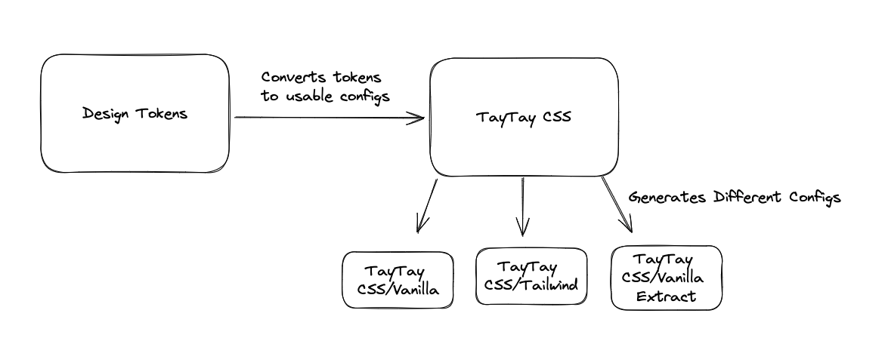
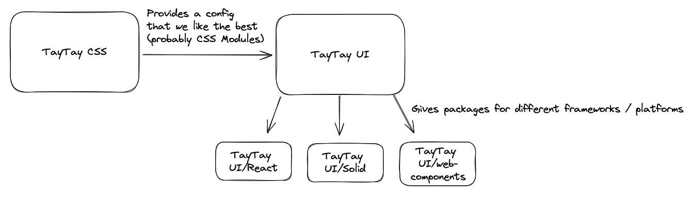
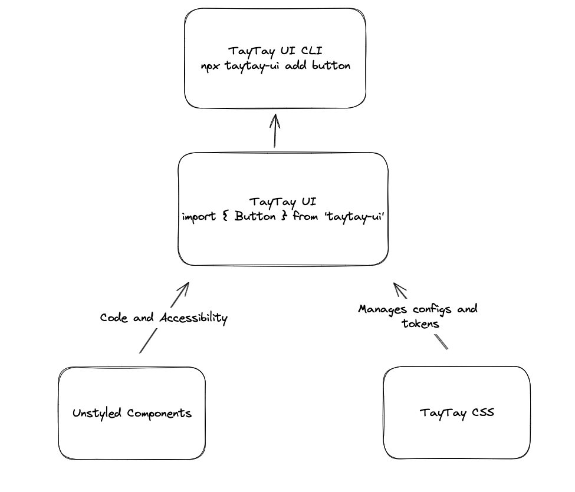

## The Problem

Everyone in the web wants a shared UI solution. Unfortunately, either nobody wants to build it, components are tied to business logic, or it gets started but gets no adoption. 
Teams outside the engineering team also have vested interests in getting this right, but often don't have the technical resources to make a robust solution for web engineers, 
or get bogged down by considerations for other platforms. Engineers want this solution and want a place for them to contribute to the solution.

In addition, there often isn't a one-size-fits-all model for web. Technologies that might be a good fit for one team or solution might not be the best for another team.

How do we engineer a solution that pushes the shared UI space forward, accelerates development on important company initiatives, and provides a good fit for engineers and non-engineers alike?

## The Solution

1. If you build it, they will come. DevX is probably in the best position to handle without user-facing applications to manage, or stakeholder mandated requirements. 
Other teams really don't have the resources or technical knowledge to tackle this at the moment, or have been too fractured by organizational concerns.
2. Allow for any number of styling solutions while still letting eventual tokens be primary upstream source. Design tokens are generally a mess, take too long to come out, 
and aren't really useful to web engineers without another layer to make them work. This solution should stillhonor overall design decisions that come from tokens 
while also allowing teams to use any overall styling soltution they want. Eg a team should be able to use CSS Modules, Vanilla Extract, Tailwind, and more with an easy and managed config that translates design tokens into their
preferred solution.
3. Give consuming devs the option to use fully managed components, or to use them as a starting point for their own needs. It's easy to think of a shared UI library as something like "Material UI for Disney", but often times more advanced uses require something more customizable than
a fully managed library. We should offer the best of both worlds: If you want to use a component as a starting point and customize from there, you get to copy/paste (or use a [CLI](https://ui.shadcn.com/docs/components/button)) our component and styles as a starting point, 
and then create your own from there. Or if you want your components fully managed by us with a direct link to the design tokens, we can offer that as a package as well.
4. Allow for any number of UI solutions. We should build our components with multiple frameworks and technologies in mind. I see no reason why we can't have a "React", "Vue", "Solid", and "Web Componenents".

### Web Components?
I'm not sold on the idea of creating foundational web components for a library like this for a simple reasons: They require a [framework](https://github.com/lit/lit/tree/main/packages/labs/ssr#readme) to use them in server side applications. 
As an application developer, [I can't just import a web component](https://stenciljs.com/docs/faq#what-are-the-limitations-of-web-components) into my favorite SSR framework: I have to set up the
Javascript needed to get the web component to be bundled on the server, and then interactive on the client. 
The [Declaritive Shadow DOM](https://caniuse.com/declarative-shadow-dom) will eventully fix this, but even Web Component frameworks like Lit still need [setup](https://lit.dev/docs/ssr/overview/) to get it to work,
and even note that it's not fully supported in all browsers yet. Unfortunately, it's not as simple as "write a foundation level component as a web component and import it into your framework of choise". That could work well for SPAs, but will break in SSR frameworks.

We could and likely should support web-component based applications by still writing web components as a target for TayTay UI; but they're not going to work as a foundation-level technology for modern UIs yet.

### TayTay CSS

Different problems require different CSS solutions. Instead of locking ourselves into one solution, we should create a tool to support all of them.

### TayTay UI

The styling solution will provide us with tokens from design, and we can consume those to create styled components. 
We should use an unstyled library for most of our components. They provide a ton of value and will greatly accelerate this process.

We'll engineer this with design and a future design system in mind, so that when tokens for that system eventually come out, they can slot right into these components.

### TayTay UI CLI

For developers who need more control over the components, we can offer a CLI that grabs the latest code and styles from TayTay UI, and copies it into their application. In addition, if they use TayTay CSS, we can give them styles that match up with the styling solution of their choice.
Inspired by [Shadcn/ui](https://ui.shadcn.com/).

## Putting it all together

TODO:
- Gather information, why are folks copy/pasting components?
- Do they just want unstyled stuff and style it themselves?
- Is there a way to get a more direct connection to the design system tokens?
- Bear, Commerce, Flagship???